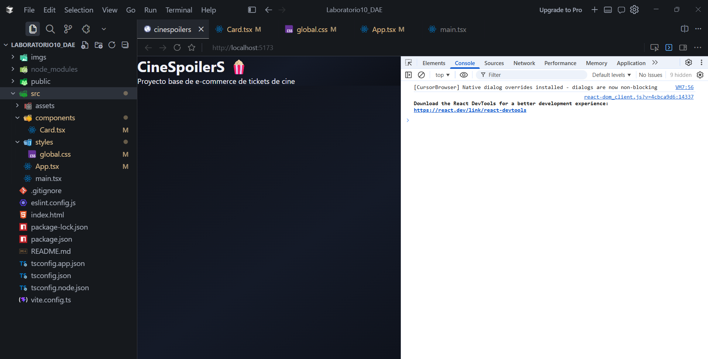
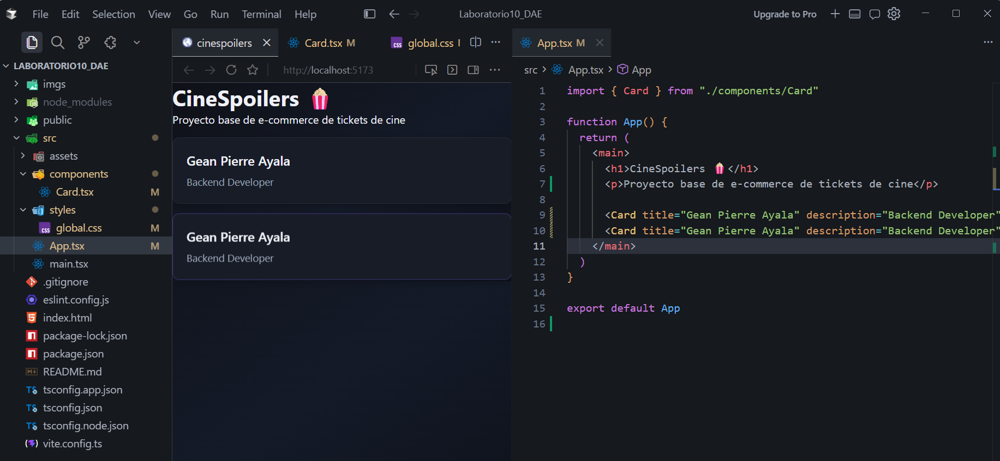
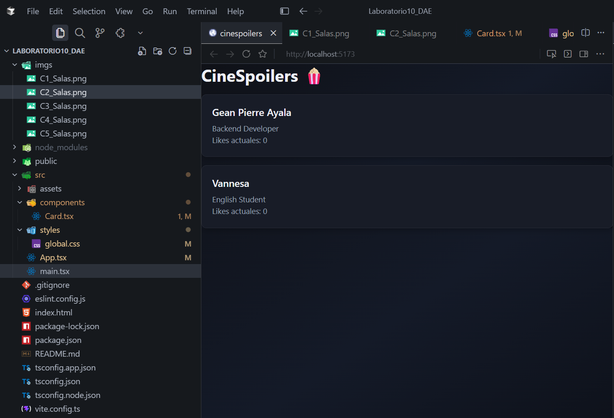
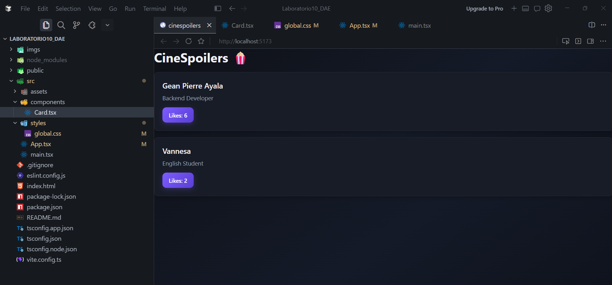
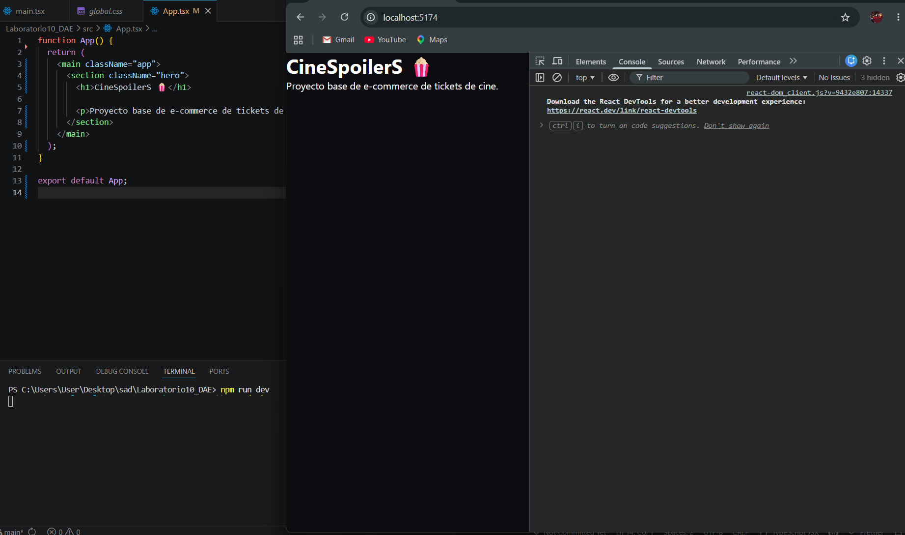
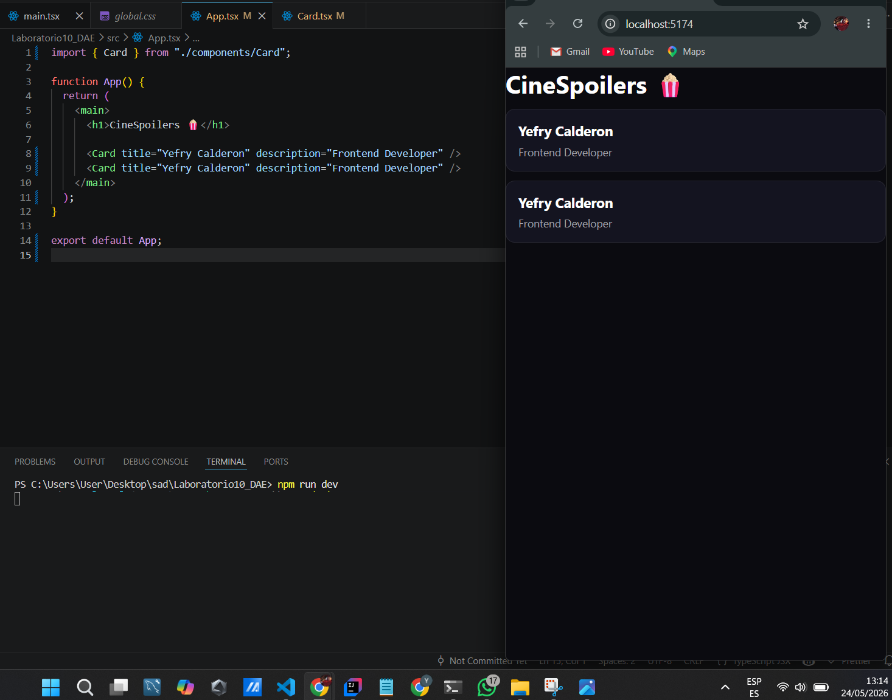
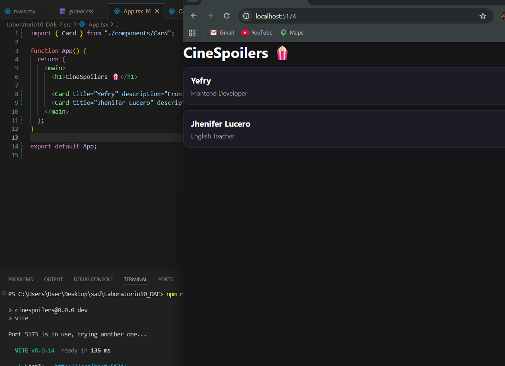
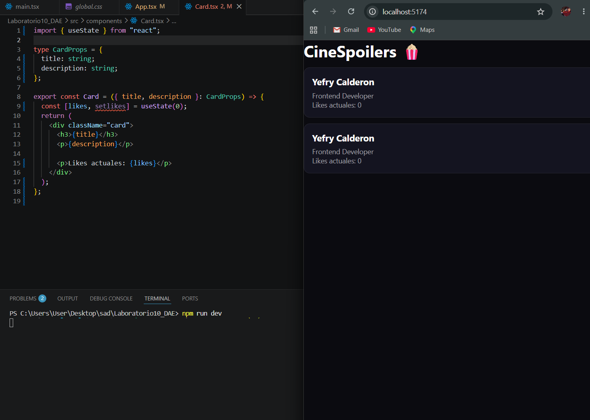
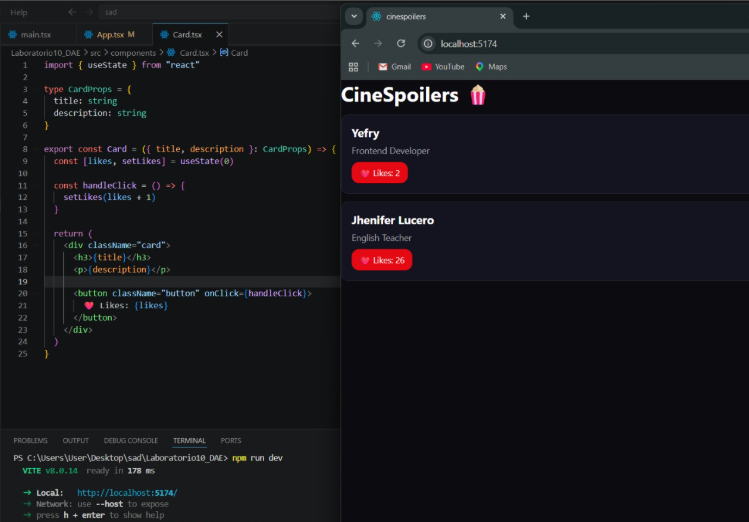

# Capturas

## Integrante 1: Salas Sebastian

### 1. Proyecto limpio, renderizado y sin errores

---

### 2. Creación de componente con variables y uso

---

### 3. Props en el componente creado

---

### 4. Estado en el componente

---

### 5. Manejo de estado mediante eventos

---

## Integrante 2: Ayala Gean Pierre

### 1. Proyecto limpio, renderizado y sin errores

---

### 2. Creación de componente con variables y uso

---

### 3. Props en el componente creado

---

### 4. Estado en el componente

---

### 5. Manejo de estado mediante eventos

---

## Integrante 3: Calderon Yefry

### 1. Proyecto limpio, renderizado y sin errores

---

### 2. Creación de componente con variables y uso

---

### 3. Props en el componente creado

---

### 4. Estado en el componente

---

### 5. Manejo de estado mediante eventos

---